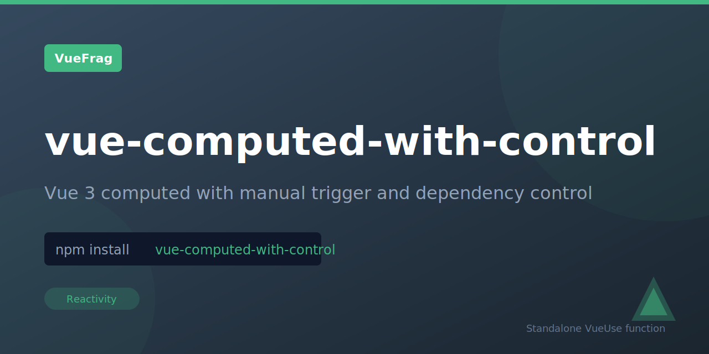

<p align="center">
  
</p>

<h1 align="center">vue-computed-with-control</h1>

<p align="center"></p>

<p align="center">
  <a href="https://www.npmjs.com/package/vue-computed-with-control"></a>
  <a href="https://www.npmjs.com/package/vue-computed-with-control"></a>
</p>

## Installation

```bash
npm install vue-computed-with-control
```

## Usage

```ts
import { computedWithControl } from '@vueuse/core'

const source = ref('foo')
const counter = ref(0)

const computedRef = computedWithControl(
  () => source.value, // watch source, same as `watch`
  () => counter.value, // computed getter, same as `computed`
)
```

## License

MIT

Extracted from [VueUse](https://vueuse.org/) for standalone use.
